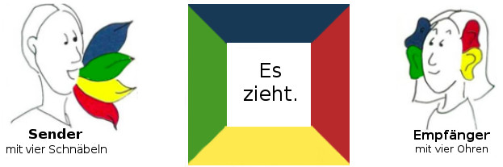

# Kommunikation nach Schulz von Thun

## These

+ Die These von Thun ist, dass jede Botschaft, ob man will oder nicht, vier Informationen enthält.

|Information|Aussage|
|-|-|
|Sachinformation|Gibt an, worüber man Informiert|
|Selbstkundegabe|Sagt aus, was ich von mir zu erkennen gebe|
|Beziehungshinweis|Zeigt, wie ich zu einer Position stehe|
|Appell|Gibt an, was ich bei der Person erreichen möchte|

+ Das Modell wird meist mit einem Quadrat dargestellt
+ In der Mitte des Bildes steht die Aussage "Es zieht."
+ Der Sender vermittelt mit dieser Aussage die vier genannten Informationen
+ Der Empfänger hingegen empfängt eben diese vier Informationen

## Sachebene

+ Auf der Sachebene steht die Information im Vordergrund
+ Es geht also um Daten, Fakten und Sachverhalte
+ Die Herausforderung für den Sender ist, die Inhalte klar und verständlich zu formulieren

## Selbstkundgabe

+ Bei jeder Aussage gibt die Person auch Informationen über sich selbst preis
+ Meist treten die Informationen in Form von Gefühlen, Werten, Eigenarten und Bedürfnissen auf
+ Explizite Informationen sind offen wahrnehmbar (Ich-Botschaften), implizite Informationen müssen durch das Gesagte interpretiert werden

## Beziehungsseite

+ Auf der Beziehungsseite gibt der Sender Informationen über seine Beziehung zum Empfänger preis
+ Die Informationen über die Beziehung können vom Empfänger wahrgenommen werden und dieser kann sich dadurch wertgeschätzt, abgelehnt, missachtet etc. fühlen

## Appell

+ Der Appell ist eine Aufforderung an den Empfänger
+ Der Appell kann offen oder verdeckt gesendet werden
