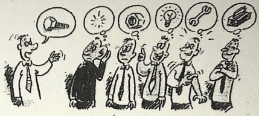

# Subjektive Wahrnehmung

## Was ist Subjektive Wahrnehmung

+ Bei der Subjektiven Wahrnehmung handelt es sich um die Individuelle Auffassung einer Aussage von einer Person
+ Das Subjektive unterscheidet sich von dem Objektiven dadurch, das eine Subjektive Wahrnehmung immer nur von einer Person und deren Wahrnehmung abhängig ist
+ Das Objektive ist durch empirische Werte nachweisbar und messbar
+ Das Große Problem mit der Subjektiven Wahrnehmung ist, das sich Denkfehler ergeben können

## Beispiel Aussage

|Wahrnehmung|Vermutung|Interpretation/Bewertung|
|-|-|-|
||Er interessiert sich nicht für das Thema|Mein Vortrag ist langweilig|
|Hr. Schulz sieht während meines Vortrags aus dem Fenster|Er ist müde|Hr. Schulz hat zu wenig geschlafen|
||Er kann sich so besonders gut auf das Thema konzentrieren|Mein Vortrag ist gut und Hr. Schulz profitiert davon|

## Quelle

[Kraus und Partner](http://www.kraus-und-partner.de/projektmanagement/grundlagen/kommunikation-und-zusammenarbeit-in-)

