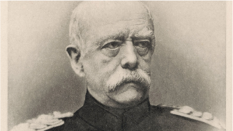

# Sozialstaat

## Entstehung

+ Die Entstehung des Sozialstaates ist sehr stark mit der Industriellen Revolution verbunden
+ In diesem Zeitraum haben sich viele Menschen vom Land in die Städte verlagert
+ Die Arbeit verlagert sich von der Landwirtschaft in die Industrie
+ Die Arbeit in den Fabriken wahr gefährlich und gesundheitschädlich
+ Die Arbeiter haben sich nach und nach in Vereinen organisiert, welche die Arbeiter im falle einer Krankheit, oder Verletzung unterstützen
+ Dise Organisationen haben nach und nach politische Vorderungen gestellt, woraus später unter anderem die SPD entstand
+ Aus Angst vor einem Machtverlust gründete Otto von Bismarck die „Bismarck‘sche Sozialgesetze“

## Sozialstaatsprinzip

+ Das Sozialstaatsprinzip schreibt dem Bundestag vor einen Sozialen Staat zu gestalten
+ Die Auslegung des Sozialen Staates ist nicht klar vorgeschrieben und muss immer wieder neu diskutiert werden
+ Das Sozialstaatsprinzip ist in "Soziale Gerechtigkeit" und "Soziale Sicherung" geglidert

## Soziale Gerechtigkeit

+ Soziale Gerechtigkeit versucht einen Ausgleich zwischen arm und reich zu schaffen
+ Dies ist zum Beispiel durch die Steuern der Fall. Personen die mehr verdienen zahlen auch mehr Steuern
+ Personen die als bedürftig gelten erhalten finanzielle Zuschüsse
+ Zudem sollen die Menschen möglichst gleiche Chancen haben
+ Eine Maßnahme für die vörderung der gleichen Chancen ist das Kostenlose Angebot von Bildung

## Soziale Sicherung

+ Die Soziale Sicherung soll die Folgen einer Lebenskrisen abmildern
+ Die Soziale Sicherung ist nach dem Versicherungsprinzip aufgebaut sprich es Zahlen viele Menschen ein, und sobald einer der Personen eien Unfall hat, zahlt die Versicherung einen Betrag aus

### Vorsorge

+ Beamte leisten keine Zahlungen in die Sozialversicherungen
+ Der Staat versorgt seine Beamten durch Steuern
+ Steuern müssen von allen Menschen ab einem bestimmten einkommen geleistet werden

### Beispiele für Staatliche Unterstützungen

|Beispiel|Aufgabe|
|-|-|
|Arbeitslosengeld II|Stellt eine Unterstützung für Personen dar, die noch erwerbsfähig sind, aber seit längerer Zeit arbeitslos sind|
|Sozialhilfe & Grundsicherung im Alter|Sichert die Existenz von Menschen die nicht mehr erwerbsfähig sind|
|Elterngeld|Eltern die ein Kind betreuen erhalten einen Ausgleich, sofern diese in diesem Zeitraum nicht arbeiten|
|Kindergeld|Eltern erhalten Kindergeld für Kinder bis zum 18 Lebensjahr und bis zum 25 Lebensjahr in einer Ausbildung, Studium etc.|
|Ausbildungsförderung|Schüler und Studierende können in Abhängigkeit vom Einkommen der Eltern eine finanzielle Unterstützung erhalten|