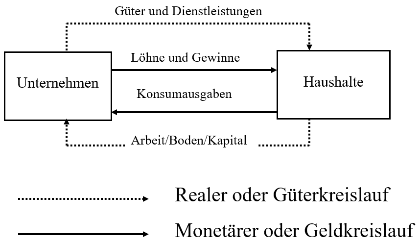

# Einfacher Wirtschaftskreislauf

## Prämisse

+ Besteht nur aus Wirtschaftssektoren und Haushalten
+ Es gibt in diesem Modell keinen Staat und kein Ausland
+ Beide Sektoren befinden sich in einen Tausch Verhältnis
+ Alles was der Haushalt benötigt wird von einem Unternehmen hergestellt
+ Haushalte Konsumieren ihr gesamtes Einkommen
+ Alle Güter werden von den Haushalten konsumiert
+ Gleichartige Transaktionen werden zu Geldstrom und Realstrom zusammengefasst
+ Nur Haushalte besitzen Arbeit, Boden und Kapital

|Akteure|Funktion|
|-|-|
|Unternehmen|Stellen Güter und Dienstleistungen bereit|
|Haushalte|Stellen Arbeit Boden und Kapital(Geld) für die Unternehmen bereit|

|Kreisläufe|Bezug|Funktion|
|-|-|-|
|Konsumausgaben|Haushalt / Unternehmen|Bezeichnet die Ausgaben der Haushalte an die Unternehmen, wofür diese Güter und Dienstleistungen erhalten|
|Löhne und Gewinne|Unternehmen Haushalte|Die Unternehmen entlohnen die Haushalte dafür, das diese ihnen Arbeit, Boden und Kapital bereit stellen|

## Grundannahme

+ Durch die Kombination von Arbeit, Boden und Kapital erstellen die Unternehmen Sachgüter und Dienstleistungen
+ Alle Ströme, die entgegengesetzt verlaufen, wie zum Beispiel Güter und Erlös, sind in ihrer Summe immer gleich groß, sprich das was für 5€ produziert wird wird auch für 5€ wieder verkauft (Es entsteht also kein Gewinn).
+ Zur Ermittlung des Sozialproduktes gibt es im einfachen Wirtschaftskreislauf drei Ansätze

|Ansatz|Durchführung|
|-|-|
|Entstehungsrecht|Man addiert die Werte aller produzierten Güter|
|Verteilungsrechnung|Man addiert die Einkommen, welche von den Unternehmen an die Haushalte gezahlt werden|
|Verwendungsrechnung|Man erfasst die Zwecke für welche die Haushalte ihr Einkommen aufwenden|

## Nutzenmaximierung

+ Jeder Haushalt hat das Ziel die Güter zu kaufen, die ihm am meisten nutzen
+ Sie haben hierbei ein begrenztes Einkommen
+ Das Sparen bedeutet ein Konsumverzicht, der einen höheren Konsum in der Zukunft möglich macht
+ Der Nutzen eines Güter wird vom Haushalt subjektiv bewertet

## Vokabular

|Begriff|Bedeutung|
|-|-|
|Sozialprodukt|Der Wert aller Dienstleistungen in einem Wirtschaftszeitraum|
|Volkseinkommen|Die Summe des Einkommens aller Haushalte|

## Quellen

+ Präsentation: Das Modell des einfachen Wirtschaftskreislaufs vom 04.05.2022
