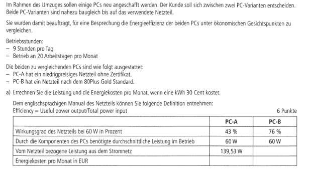

# Aufgabe

## Lösung

- **Gegeben**
- - Laufzeit am Tag $h_{Day}=9$
- - Tage im Monat $m=20$
- - Kosten einer Kilowatt Stunde $kosten_{Kilowatt}=0,3€$

- **PC-A**
- - Wirkungsgrad: $\eta_a=0,43$
- - Durchschnittliche Leistung im Betrieb $d_a=60W$
- - Bezogene Leistung $l_a=139,53W$
- **PC-B**
- - Wirkungsgrad: $\eta_b=0,76$
- - Durchschnittliche Leistung im Betrieb $d_b=60W$

- **Gesucht**
- - Energiekosten pro Monat in Euro

- **Rechnung für PC-A**
1. Wir müssen wissen, wie viele Stunden im Monat der Rechner läuft
- - $h_{Monat}=m*h_{Day}=>20*9=180$
2. Um die Kosten für einen Monat zu bekommen Rechnen wir
- - $kosten_{Monat}=h_{Monat}*kosten_{Kilowatt}*betrieb_{Kilowatt}$
3. Gegeben sind uns bereits die Kosten für eine Stunde in Watt, wir brauchen aber die Kosten in Kilowatt
- - $betrieb_{Watt}=139,53$
4. Wir berechnen den Verbrauch daher in Watt um, indem wir durch $1000=10^3$ dividieren
- - $betrieb_{Kilowatt}={betrieb_{Watt} \over 10^3}=>{139,53 \over 10^3}=0,13953$
