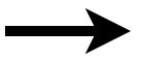
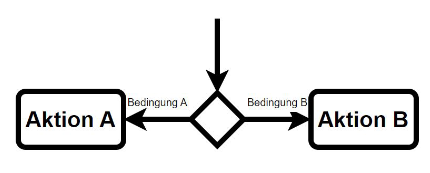
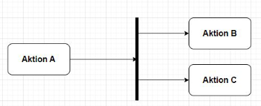
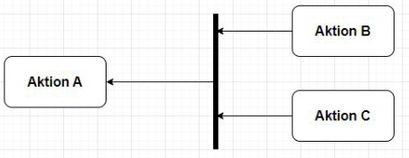
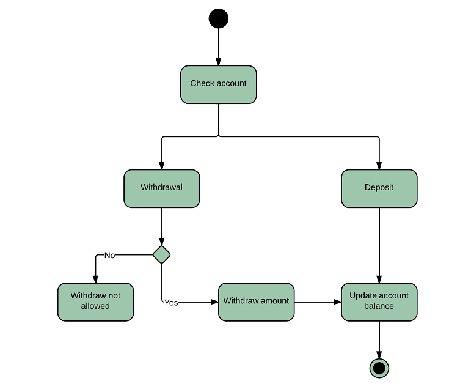

# Aktivitätsdiagramm

- Soll die von einem System ausgeführten Aktivitäten abbilden
- Es soll als Schnittstelle zwischen Geschäfts und Entwickler Seite dienen, um eine Gemeinsame Basis zu finden und die selben Prozesse zu verstehen.
- Es gibt keine Zustandsäußerungen
- Ist ähnlich zu einem Programm Ablaufplan

## Beispiele für die Anwendung
- Darstellung der Logik eines Algorithmus
- Illustration von Geschäftsprozessen
- Modellierung von Software Architekturelementen

---

## Elemente

|Element Name|Beschreibung|Darstellung|
|------------|------------|-----------|
|Start Knoten|Symbolisiert den Beginn einer Aktivität||
|End Knoten|Stellt den finalen Schritt in der Aktivität dar||
|Ablauf Ende|Bricht eine Aktivität ab||
|Aktion|Der Nutzer oder die Software führt eine bestimmte Aktivität aus||
|Kante (Flussrichtung)|||
|Verzweigung|Führt eine Aktion abhängig von einer oder mehreren Bedingungen aus||
|Zusammenführung|||
|Aufspaltung|Durch eine Aufspaltung werden mehrere Aktivitäten gleichzeitig ausgeführt||
|Synchronisation|Durch eine Synchronisation werden zwei ||
|Aktivität|||

---

|Vorteile|Nachteile|
|--------|---------|
|Kann schnell erstellt werden|Die Abwesenheit eines Zustandes kann zur Verwirrung führen|
|Kann sowohl mit als auch ohne OOP verwendet werden|Es gibt keinen vordefinierten Detailgrad|
|Es gibt keine Dopplungen||

---

## Banken Beispiel

## Quellen

- [Lucid Chart](https://www.lucidchart.com/pages/de/uml-aktivitatsdiagramme)
- [Youtube Thomas Grosser](https://www.youtube.com/watch?v=q3xEiJzCLsg)

