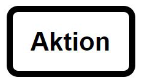

# Aktivitätsdiagramm

- Hat das Ziel komplexe Abläufe klar darzustellen
- Es gibt keine Zustandsäußerungen
- Ist ähnlich zu einem Programm Ablaufplan

## Vorteile und Nachteile

|Vorteile|Nachteile|
|--------|---------|
|Kann schnell erstellt werden|Die Abwesenheit eines Zustandes kann zur Verwirrung führen|
|Kann sowohl mit als auch ohne OOP verwendet werden|Es gibt keinen vordefinierten Detailgrad|
|Es gibt keine Dopplungen||

## Elemente

|Element Name|Darstellung|
|-------|-----------|
|Start Knoten||
|End Knoten||
|Ablauf Ende| |
|Aktion||
|Kante (Flussrichtung)||
|Verzweigung||
|Zusammenführung||
|Aufspaltung||
|Synchronisation||
|Aktivität||

