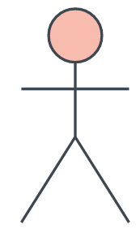
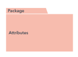
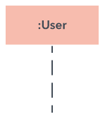
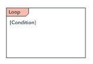
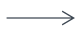
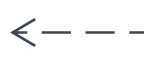
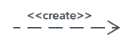

# Sequenz Diagramm

- Bei einem Sequenzdiagramm werden Interaktionen zwischen einer Gruppe von Objekten abgebildet und es gibt eine Reihenfolge an
- Wird teils auch als Ereignisdiagramm bezeichnet
- Wird zum Beispiel verwendet, um zu verstehen, welche Anforderungen eine neues System stellt

|Name|Beschreibung|Symbol|
|----|------------|------|
|Objekt Symbol|Stellt eine Klasse bzw. ein Objekt dar. Es sollte jedoch keine Attribute enthalten||
|Aktivitätsbalken|Die Länge des Balkens soll die Dauer zum abschließen einer Aufgabe darstellen||
|Akteur-Symbol|Stellt eine Person dar, welche mit dem System interagiert||
|Paket|Soll interaktive Elemente darstellen||
|Lebenslinie|Stellt einen Zeitverlauf dar und zeigt auf, was in diesem Verlauf mit dem Objekt passiert||
|Optionsschleife|Stellt dinge dar, welche unter einer bestimmte voraussetzung eintreten||
|Alternativen|Stellt eine Auswahl von Elementen dar, welche sich in der Regel gegenseitig ausschließen||

## Nachrichten

|Name|Beschreibung|Symbol|
|----|------------|------|
|Synchrone Nachricht|Der Absender muss auf die Antwort der Nachricht warten||
|Asynchrone Nachricht|Der Absender muss nicht auf die Antwort warten||
|Asynchrone Antwort Nachricht|Gibt eine Antwort auf eine Asynchrone Anfrage||
|Asynchrone Nachrichten Erstellung|Eine Solche Nachricht erstellt eine neues Objekt||

## Quellen

[Lucidchart](https://www.lucidchart.com/pages/de/uml-sequenzdiagramme)