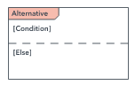
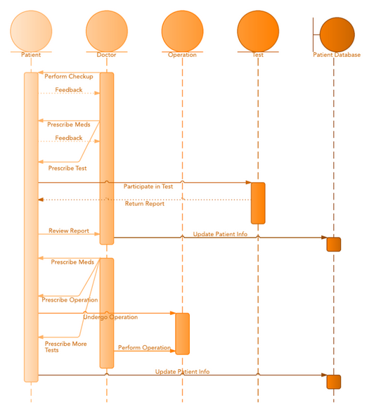

# Sequenz Diagramm

- Bei einem Sequenzdiagramm werden Interaktionen zwischen einer Gruppe von Objekten abgebildet und es gibt eine Reihenfolge an
- Wird teils auch als Ereignisdiagramm bezeichnet
- Wird zum Beispiel verwendet, um zu verstehen, welche Anforderungen eine neues System stellt

## Symbole

|Name|Beschreibung|Symbol|
|----|------------|------|
|Objekt Symbol|Stellt eine Klasse bzw. ein Objekt dar. Es sollte jedoch keine Attribute enthalten||
|Aktivitätsbalken|Die Länge des Balkens soll die Dauer zum abschließen einer Aufgabe darstellen||
|Akteur-Symbol|Stellt eine Person dar, welche mit dem System interagiert||
|Paket|Soll interaktive Elemente darstellen||
|Lebenslinie|Stellt einen Zeitverlauf dar und zeigt auf, was in diesem Verlauf mit dem Objekt passiert||
|Optionsschleife|Stellt dinge dar, welche unter einer bestimmte voraussetzung eintreten||
|Alternativen|Stellt eine Auswahl von Elementen dar, welche sich in der Regel gegenseitig ausschließen||

## Nachrichten

|Name|Beschreibung|Symbol|
|----|------------|------|
|Synchrone Nachricht|Der Absender muss auf die Antwort der Nachricht warten||
|Asynchrone Nachricht|Der Absender muss nicht auf die Antwort warten||
|Asynchrone Antwort Nachricht|Gibt eine Antwort auf eine Asynchrone Anfrage||
|Asynchrone Nachrichten Erstellung|Eine Solche Nachricht erstellt eine neues Objekt||
|Antwort Nachricht|Stellen Antworten auf Anrufe dar||
|Löschnachricht|Eine Solche Nachricht zerstört ein Objekt||

## Beispiel

- In diesem Beispiel geht es um den Besuch in einem Krankenhaus
- Wir haben die Akteure **Patient**, **Doctor**, **Operation**, **Test** und **Patient Database**
- Zu beginn können wir sehen, das der **Doctor** die Aktionen **Perform Checkup** und **Prescribe Meds** am Patienten ausführt ausführt
- Dies wird durch ``Synchrone Nachrichten`` dargestellt
- Der Patient gibt ein **Feedback** an den **Doctor** und verwendet dafür ``Antwort Nachrichten``
- Danach führt der Arzt die Aktion **Prescribe Test** aus und erhält **keine** Antwort vom Patienten
---
- Der Patient versendet nun eine Nachricht an den Akteur **Test** und erhält später die Antwort **Return Report**
- Danach gibt der **Patient** die Nachricht **Review Report** an den Arzt, welcher darauf die Nachricht **Update Patient info** an den Akteur **Patient Database** versendet
---
- Nach einer Pause versendet der **Doctor** die Nachricht **Prescribe Meds** und etwas später noch die Nachricht **Prescribe Operation** an den **Patient**
- Dieser sendet darauf die Nachricht **Undergo Operation** an den Akteur **Operation**
- Während der Operation verschreibt der **Doctor** mehr Tests und führt danach die Operation durch
- Zum Abschluss wird ein Update auf die Patienten Datenbank durchgeführt.
---

## Quellen

[Lucidchart](https://www.lucidchart.com/pages/de/uml-sequenzdiagramme)