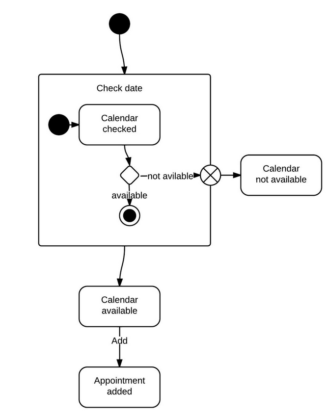
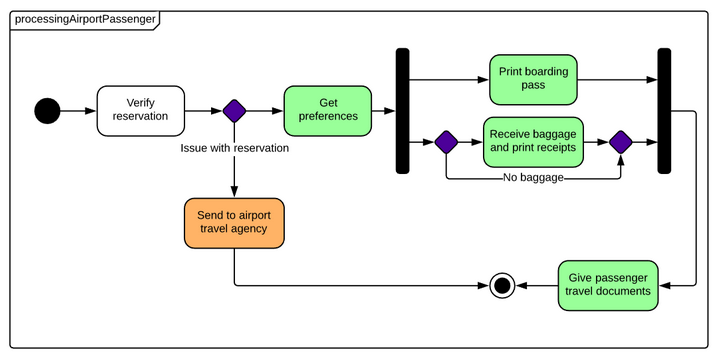

# Zustandsdiagramm

- Bildet Übergänge zwischen Objekten ab
- Je nach Eingabe wird der Status geändert, oder es wird eine Aktion durchgeführt
- Das Zustandsdiagramm versucht möglich alle Zustände und Kombinationen darzustellen

---

## Elemente in einem Zustandsdiagramm

- Dunkler Kreis
    - Stellt den Startpunkt dar
- Terminator
    - Gibt den Endpunkt an
- Zustände (State)
    - Zustände werden mit Rechtecken dargestellt
- Zusammengesetzter Zustand
    - Ein Zustand der sich aus mehreren Zuständen zusammen setzt
- Pseudostatus Entscheidung
    - Wird mit einer Raute dargestellt
    - Stellt eine dynamische Bedingung dar
- Ereignis
    - Wird als Pfeil dargestellt, welcher auf ein anderes Ereignis zeigt
    - Stellt das Ende eines Zustandes dar
- Austrittspunkt
    - Wird durch einen Kreis mit einem Kreuz in der Mitte dargestellt
    - Wird in der Regel dazu verwendet darzustellen, dass der Prozess fehlerhaft ist
- Ausgangszustand
    - Ein Marker für den Ausgangszustand in dem betrachteten Prozess, dargestellt durch einen dunklen Kreis mit einem Übergangspfeil
- Guard
    - Eine Boolesche Bedingung, die einen Übergang zulässt oder verhindert
    - Sie wird über dem Übergangspfeil eingetragen

---

## Beispiel

---

## Quellen

- [Lucidchart](https://www.lucidchart.com/pages/de/maschinenzustandsdiagramm)