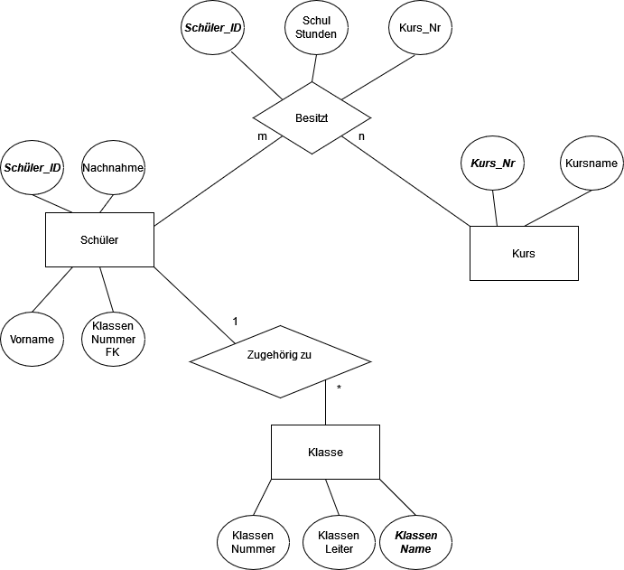

# Entity Diagramm

## Nutzen eines Entity Diagramms

+ Ein Entity Diagramm wird verwendet, um den Aufbau einer Datenbank darzustellen
+ Es werden Beziehungen zwischen entity's(Tabellen) durch 

## Aufbau eines Entity Diagramms

|Name|Symbol|Zweck|
|-|-|-|
|Entity||Stellt eine Tabelle aus der Datenbank dar|
|Attribut||Stellt ein Attribut in Form eines Primitiven Datentypen dar|
|Beziehung||Stellt eine Beziehung zwischen zwei entity's dar. Kann auch selbst eine Tabelle sein, sofern die Beziehung auf zwei oder mehr entity's map't|

## Beispiel Aufbau eines Diagramms

+ Das Diagramm beschreibt die Beziehung von "Schülern", "Kursen", und "Klassen"
+ Wir haben drei entity's mit den Namen "Schüler", "Kurs" und "Klasse"
+ Es gibt drei Beziehungen diese sind "Besitz", "Zugehörig zu"
+ Alle entity's besitzen Attribute, wobei die Primärschlüssel fett und kursiv dargestellt werden
+ Wir können sehen, das der Schüler in einer Beziehung mit den Kurs steht
+ An den Kardinalitäten(Den Buchstaben bzw. Zahlen am Rande der Beziehungen), können wir erkennen, wie oft eine entity eine andere besitzt
+ Im falle von Schüler und Kurst kann ein Schüler beliebig viele Kurse wählen und der Kurs kann beliebig viele Schüler haben.
+ Hierbei ergibt sich ein Mapping, da der Besitz keine vollständige Entity bildet, jedoch Attribute für das Mapping bereit stellt
+ Die Beziehung zwischen Schüler und Klasse wird durch die Kardinalitäten 1 zu m beschrieben
+ Jeder Schüler besitzt nur eine Klasse, jedoch kann eine Klasse mehrere Schüler besitzen
+ Die Beziehung wird hierbei durch eine Zugehörigkeit ausgedrückt

## Quelle

+ [Informatik-SimpleClub](https://www.youtube.com/watch?v=baF9b5Lkiio)

