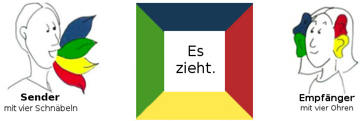

# Kommunikation nach Schulz von Thun

## These

+ Die These von Thun ist das Jede Botschaft, ob man will oder nicht vier Informationen enthält

|Information|Aussage|
|-|-|
|Sachinformation|Gibt an, worüber man Informiert|
|Selbstkundgabe|Sagt aus was ich von mir zu erkennen gebe|
|Beziehungshinweis|Zeigt wie ich zu einer Position stehe|
|Apell|Gibt an was ich bei der Person erreichen möchte|

+ Das Modell wird meist mit einem Quadrat dargestellt
+ In der Mitte des Bildes steht die Aussage es zieht
+ Der Sender vermittelt mit dieser Aussage die vier genannten Informationen
+ Der Empfänger hingengen empfängt eben diese vier Informationen

## Sachebene

+ Auf der Sachebene steht die Information im Vordergrund
+ Es geht also um Daten, Fakten und Sachverhalte
+ Die Herausforderung für den Sender ist die Inhalte klar und verständlich zu formulieren

## Selbstkundgabe

+ Bei jeder Aussage, gibt die Person auch Informationen über sich selbst preis
+ Meist treten die Informationen in Form von Gefühlen, Werten, Eigenarten und Bedürfnissen auf
+ Explizit sind hiermit Ich-Botschaften gemeint

## Beziehungseite

+ Auf der Beziehungseite gibt der Sender Informationen über seine Beziehung zur Person preis
+ Die Informationen über die Beziehung können vom Empfänger wahrgenommen werden und diser kann sich dadurch wertgeschätzt, abgelehnt, missachtet, etc. fühlen

## Apell

+ Der Apell ist eine Auforderung an den Empfänger
+ Der Apell kann offen, oder verdeckt gesandt werden
