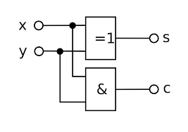
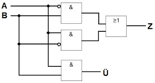
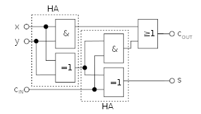

# Logit Gatter

## Und gatter (And)

### Tabelle

|A|B|Y|
|-|-|-|
|0|0|0|
|0|1|0|
|1|0|0|
|1|1|1|

## Oder gatter (Or)

### Tabelle

|A|B|Y|
|-|-|-|
|0|0|0|
|0|1|1|
|1|0|1|
|1|1|1|

## Nicht gatter (Not)

### Tabelle

|A|Y|
|-|-|
|0|1|
|1|0|

## Nicht und Gatter (Nand)

### Tabelle

|A|B|Y|
|-|-|-|
|0|0|1|
|0|1|1|
|1|0|1|
|1|1|0|

## Nicht Oder gatter (Nor)

### Tabelle

|A|B|Y|
|-|-|-|
|0|0|1|
|0|1|0|
|1|0|0|
|1|1|0|

## Exclusives Oder (Xor)

### Tabelle

|A|B|Y|
|-|-|-|
|0|0|0|
|0|1|1|
|1|0|1|
|1|1|0|

### Formel

( !( A && B ) ) && (A || B)

## Exclusives nicht Oder (NXor)

### Tabelle

|A|B|Y|
|-|-|-|
|0|0|1|
|0|1|0|
|1|0|0|
|1|1|1|

## Addierer

### Halb Addierer

+ Der Halbaddierer kann zwei eingaben verarbeiten und gibt an ende aus, ob es einen Übertrag gibt(c), oder ob es zu einer Summe (s) kommt.

+ Der Block =1 steht für ein Xor und kann durch die Grundgatter und or dargestellt werden.

+ Ein Halbaddierer mit Grundgattern sähe dann so aus.

### Volladierer

+ Der Volladdierer funktioniert ähnlich wie der Halbaddierer. Der Unterschied besteht darin, das der Volladierer in der Lage ist drei Werte zu verarbeiten.

+ Der Volladierer nimmt sowohl die Zwei eingaben auf, als auch einen Übertrage, der zum beispiel von einem Halbaddirer erzeugt wurde.

