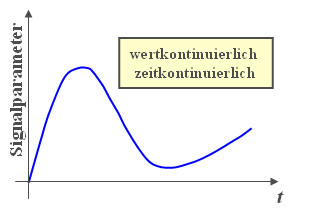
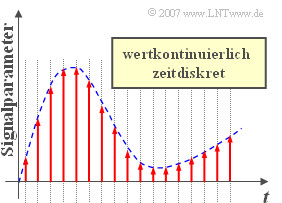
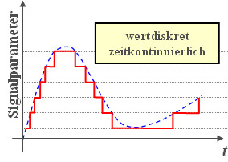
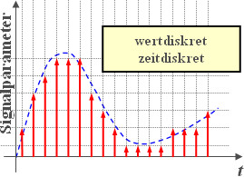

# Signalparameter

## Wertkontinuierlich und Zeitkontinuierlich

+ Das Signal wird defacto in Echtzeit übertragen und es gibt keine klaren Einheiten für die Zeit, oder den Wert.

## Wertkontinuierlich und Zeitdiskret

+ Die Zeit wird in einheiten dargestellt und die werte kommen ohne einheiten vor.

## Wertdiskret und Zeitkontinuierlich

+ Die Werte werden in einheiten unterteilt, die Zeit aber nicht.

## Wertdiskret und Zeitdiskret

+ Sowohl die Zeit, als auch die Werte kommen in klaren einheiten.

## Unterschiede zwischen Diskret und Kontinuierlich

### Diskret

+ Bei einem diskreten Signal treten die Informationen in klar definierten Blöcken auf.

+ Es werden dementsprechend auch nur fest definierte Ergebnisse angezeigt.

### Kontinuierlich

+ Es besteht ein stetiger Strom an Daten, der nicht in bestimmte Blöcke eingeteilt wird.