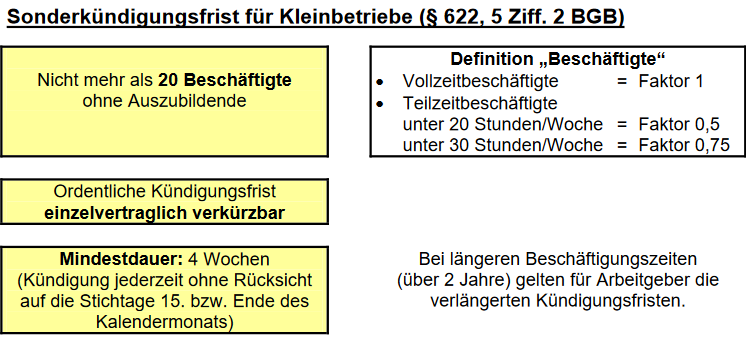

# Kündigungen

## Ordentliche und Außerordentliche Kündigung

+ Eine Kündigung kann entweder Außerordentlich sein, oder Ordentlich.

### Ordentliche Kündigung

+ Bei einer Ordentlichen Kündigung werden Fristen und Soziale Umstände beachtet und es gibt einen klaren Kündigungsgrund, der entweder im Verhalten, der Person selbst, oder im Betrieb selbst liegt.
  
### Außerordentliche Kündigung

+ Eine Außerordentliche Kündigung liegt dann vor, wenn ein wichtiger Grund im Sinne des [§ 626 BGB](https://www.gesetze-im-internet.de/bgb/__626.html) genannt wird. In diesem Fall gilt keine Kündigungsfrist.

+ Eine Außerordentliche Kündigung wird umgangssprachlich auch als fristlose Kündigung bezeichnet.

+ Damit eine Außerordentliche Kündigung geltend gemacht werden kann, müssen andere Maßnahmen erschöpft sein (Abmahnungen, Versetzung, etc.)

+ Eine Außerordentliche Kündigung kann zum Beispiel dadurch begründet werden, dass eine weitere Zusammenarbeit nicht weiter zugemutet werden kann, wobei alle Umstände des Einzelfalles abgewägt werden müssen.

+ Sobald der Arbeitgeber von dem außerodentlichem Kündigungsgrund erfährt, muss er dem Arbeitnehmer innerhalb von zwei Wochen kündigen und dem Arbeitnehmer unverzüglich über die Kündigung in Kenntnis setzen.
  
### Konkrete Kündigungsgründe bei einer Außerordentlichen Kündigung

|Arbeitgeber|Arbeitnehmer|
|:-:|:-:|
|Anhaltende Krankheit des Arbeitnehmers|Eigene Dienstunfähigkeit|
|Längere Abwesenheit|Arbeitgeber verletzt Fürsorge und Vergütungspflicht|
|Verletzung der Dienstleistung, oder Schweigepflicht, oder des Wettbewerbsverbotes||
  

---

## Prüfschema einer Kündigung

### Ausgang der Kündigung

+ Als erstes muss sichergestellt werden, dass die Kündigung den Arbeitnehmer
erreicht hat. Ist dies nicht der Fall, ist die Kündigung nicht Ordentlich.

### Besonderer Schutz des Arbeitnehmers

+ Sofern die Kündigung zugegangen ist, muss geprüft werden, ob es einen besonderen Schutz für diesen Mitarbeiter gibt. Sofern es einen Schutz für diesen Arbeiter gibt, ist die Kündigung unzulässig.

### Beispiel für einen besonderen Kündigungsschutz
+ Auszubildende
+ Mitglieder des Betriebsrates / deren Vertretung
+ Schwangerschaft
+ Wehrpflicht
+ Schwerbehinderung

### Betriebsrat
+ Des weiteren muss zudem der Betriebsrat über die Kündigung informiert worden sein. Ist dies nicht der Fall, so ist die Kündigung nicht Ordentlich.

+ In Abhängigkeit  von der Entscheidung des Betriebsrates, kommt es zu folgenden Szenarien.

#### Fall 1 : Der Betriebsrat stimmt der Kündigung zu.

+ In diesem Fall, gilt  die nur noch die Kündigungsfrist nach
[§ 622BGB](https://www.gesetze-im-internet.de/bgb/__622.html)

+ Der Arbeitnehmer kann nun innerhalb  von drei Wochen eine Klage einreichen.

#### Fall 2: Der Betriebsrat stimmt der Kündigung nicht zu.

+ In diesem Fall kann der Betriebsrat sich zum Beispiel auf einen in [§ 102 BetrVG](https://www.gesetze-im-internet.de/betrvg/__102.html) definierten Grund berufen. Danach müsste der Arbeitgeber auf ein Urteil des Arbeitsgericht warten.
Entscheidet das Gericht gegen den Arbeitnehmer, so hat er auch hier wieder die Möglichkeit mit einer Frist von drei Wochen Klage einzureichen. Bist dahin muss der Arbeitnehmer weiter beschäftigt werden.

+ Falls es keinen zutreffenden Grund im [§ 102 BetrVG](https://www.gesetze-im-internet.de/betrvg/__102.html) gibt, so kann er maximal seine Bedenken über eine Kündigung mitteilen. Der weitere Ablauf verläuft nach Fall 1.

### Klage

+ Im falle, das der Betriebsrat keine Grund im [§ 102 BetrVG](https://www.gesetze-im-internet.de/betrvg/__102.html) gefunden hat, so kann es mit einer Frist  von drei Wochen zu einer Klage des Arbeitnehmers kommen.

+ Die Kündigung wird nun vom Gericht während einer Verhandlung entweder für wirksam, oder unwirksam erklärt.

+ Als gründe vor Gericht, kann der Arbeitgeber entweder betriebliche Gründe, das Verhalten, oder die Persönlichkeit des Arbeitnehmers als Grundlage nennen.

#### Gründe für eine Wirksame Kündigung

+ Bei einer Wirksamen  Kündigung gilt als grundlegende Voraussetzung, das dem Arbeitgeber eine weitere Beschäftigung nicht zumutbar ist.

+ Wird eine Kündigung aus betrieblichen gründen gerechtfertigt, muss zudem belegt werden, das soziale Gründe beachtet wurden.

+ Sind die Gründe berechtigt und die Voraussetzungen erfüllt, so wird die Kündigung vom Gericht als Wirksam gewertet.

#### Gründe für eine Unwirksame Kündigung

+ Der Arbeitgeber bezieht sich in seiner Klage nicht auf das Verhalten, die Person, oder auf betriebliche Gründe.

+ Die Grundvoraussetzung, nämlich das die Weiterbeschäftigung dem Arbeitgeber nicht zumutbar ist, ist nicht erfüllt. Somit kann dem Arbeitnehmer nicht gekündigt werden.

+ Im falle einer betrieblich begründeten Kündigung, könnten noch soziale Gründe für eine Ungültigkeitserklärung entscheidend  sein.

---

## Kündigungsfristen

+ Bei einer Kündigung sind bestimmte Fristen einzuhalten. Diese sind im
[§ 622BGB](https://www.gesetze-im-internet.de/bgb/__622.html) festgehalten.

+ Die Kündigungsfrist legt einen Zeitraum fest, in welchem der Arbeitnehmer beim Arbeitgeber weiter beschäftigt bleibt, bis er zu einem festen Termin den Betrieb verlässt.

### Grobe Übersicht:

+ Das Arbeitsverhältnis eines Arbeiters oder eines Angestellten (Arbeitnehmers) kann mit einer Frist von vier Wochen zum Fünfzehnten oder zum Ende eines Kalendermonats gekündigt werden.

+ Für eine Kündigung durch den Arbeitgeber beträgt die Kündigungsfrist, wenn das Arbeitsverhältnis in dem Betrieb oder Unternehmen 

+ Ist das Arbeitsverhältnis kürzer als zwei Jahre, beträgt die Frist vier Wochen, und die Kündigung ist auch am 15 des Monats erlaubt, zuzüglich zum Ende des Kalendermonats.

+ Die Frist gilt immer zum Ende des Kalendermonats.

|Jahre im Betrieb| Frist in Monaten|
|:-:|:-:|
|2|1|
|5|2|
|8|3|
|10|4|
|12|5|
|15|6|
|20|7|

### Sonderkündigungsfristen für Kleinbetriebe

+ Bei Kleinbetrieben gelten folgende Fristen

---

## Kündigungen in der Ausbildung

### Wechsel des Ausbildungsplatzes

+ Sofern der Auszubildende den Arbeitsplatz wechseln möchte, so sollte er als erstes damit beginnen sich einen neuen Arbeitsplatz zu suchen, bevor er die Kündigung einreicht.

+ Dadurch wird deutlich, dass die Kündigung am derzeitigen Betrieb liegt, und nicht vom Arbeitgeber gewünscht wird. Zudem ist der Druck für den Auszubildenden geringer.

+ Sofern die Probezeit noch gilt, kann sowohl der Arbeitgeber, als auch der Auszubildende das Arbeitsverhältnisses ohne Angabe von gründen jederzeit kündigen. Die Kündigung muss schriftlich erfolgen. Die Regelung findet sich in [§22BBIG](https://www.gesetze-im-internet.de/bbig_2005/__22.html).

---