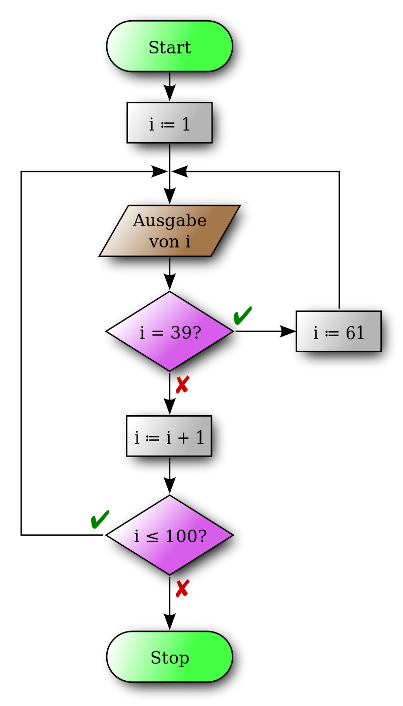

# Diagramme

## Nassi-Shneidermann Struktogramm

+ Anweisung 1
+ Anweisung 2
+ Anweisung 3

## Programm-Ablaufplan

+ Start -> Anweisung 1 -> Anweisung 2 -> Anweisung 3 -> Ende

### Beispiel Bild



### Ausdruck des Bildes in Java

```Java
int i= 1;
while(i <= 100)
{
    System.out.println(i);

    if(i == 39)
    {
        i = 61;
    }
    else
    {
        i++;
    }
}
```


### Beispiel Java Programm

```Java

int a = 1;
int b = 2;
int c = 3;
methodenAufruf();

```
