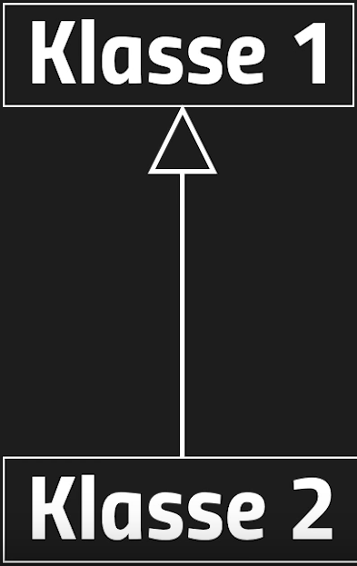

# Uml Diagramm

## Assoziationen

- Bei einer Assoziation werden Klassen mit einander verbunden und in eine Beziehung zueinander gestellt

- **Aggregation**
- - Drückt aus, das eine der Klassen die andere besitzt
- - Wird mit einer leeren Raute dargestellt
- - In der unteren Darstellung ist angegeben, das die Klasse 1 keine oder beliebig viele Klassen von der Klasse 2 besitzt
- - Die Klasse 1 wird hierbei als Aggregationsklasse und die Klasse 2 als Teilklasse bezeichnet
- - Sowohl die Klasse 1, als auch die Klasse zwei können unabhängig voneinander existieren

- **Komposition**
- - Eine Komposition ist eine stärkere Form der Aggregation
- - Bei einer Komposition können die Klassen, welche in einer Beziehung zueinander stehen nicht existieren, ohne die jeweils andere
- - Die Komposition wird mit einer ausgefüllten Raute dargestellt
- - Wird eine der Klassen entfernt, so wird auch die jeweils andere entfernt

- **Gerichtete Assoziation**
- - Bei einer gerichteten Assoziation wird ein Pfeil verwendet, um zu signalisieren, dass nur eine der Klassen mit der anderen Klasse in Verbindung steht. Die andere Klasse hat keine Verbindung mit der jeweils anderen

**Vererbung**
- - Bei der Vererbung werden Attribute und Methoden an die andere Klasse weiter gegeben
- - In Uml wird dies durch einen Pfeil dargestellt, welcher am Ende ein leeres Dreieck hat
- - Die Bezeichner public, private protected bestimmt darüber, welche der Attribute
- - Die Klasse 1 ist hierbei die Oberklasse und die Klasse zwei ist die Unterklasse
- - In dieser Grafik erbt die Klasse 2 von der Klasse 1

