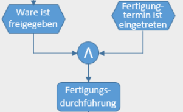
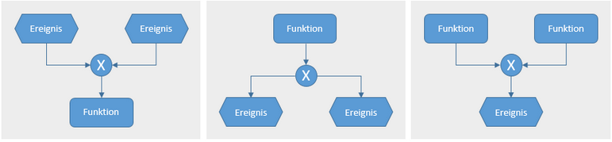

# Ereignisgesteuerte Prozesskette

## Beschreibung

Bei der EPK handelt es sich um eine Darstellung, welche Standardprozesse beschreiben soll. Die Darstellung wird aus verschiedenen Komponenten aufgebaut.

|Komponente|Symbol|Definition|
|-|-|-|
Ereignis||Das Ereignis ist meist das Ergebnis einer Funktion und meist eine Funktion auslöst.
|Funktion||Beschreibt, was nach einem Ereignis geschehen soll. Können ein Ereignis hervorbringen. Ist meist mit zeitlichen Aufwand verbunden.
|Organisationseinheit||Beschreibt von wem eine Bestimmte Funktion ausgeführt werden soll (Beschreibt die Stelle und keine Mitarbeiter)
|Informationsobjekt||Wird nur mit Funktionen verknüpft und liefert zusätzliche Informationen über die Funktion|
Verknüpfung (Operatoren)||Sind logische Verknüpfungen zwischen Ereignisgen|
Prozesswegweiser||Zeigt eine Verbindung zu einem anderen Prozess auf (Unterprozess)|
Kontrollfluss||Stellt Verbindungen zwischen den Objekten dar und zeigt damit eine Abhängigkeit auf. Kann durch Verknüpfungen aufgespalten werden. Der Ablauf sollte möglichst von Oben nach Unten erfolgen.

## Übersicht Verknüpfungen

+ Es gibt drei Vergnügungsarten

### Und Verknüpfung
Die Und-Verknüpfung drückt aus, das zwei, oder mehr Ereignisse eingetreten sein müssen, damit die nächste Funktion starten kann.

### Oder Verknüpfung

Bei der oder Verknüpfung muss mindestens eines der angegebenen Ereignisse eingetreten sein, bevor der Prozess starten kann.

### Exklusives Oder

Bei einem Exklusiven oder darf nur eines der Ereignisse  stattfinden, sofern beide stattfinden, wird die Funktion nicht ausgeführt.

## Quellen

Object Übersicht: [Affinis.de](https://www.affinis.de/fachartikel/projektmanagement/ereignisgesteuerte-prozesskette-epk/)