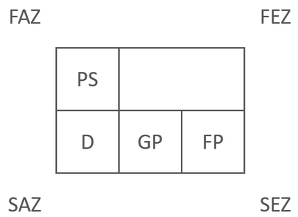
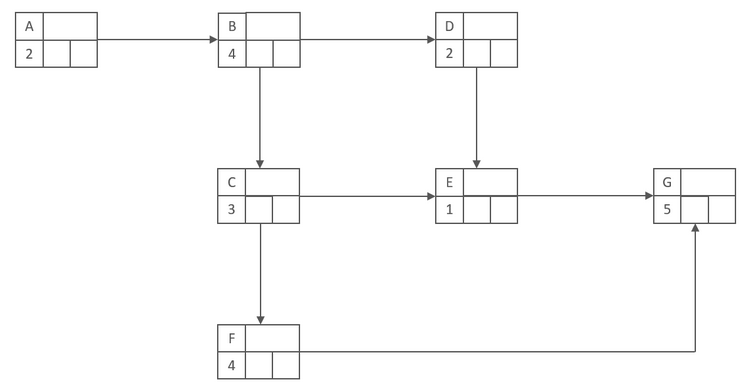
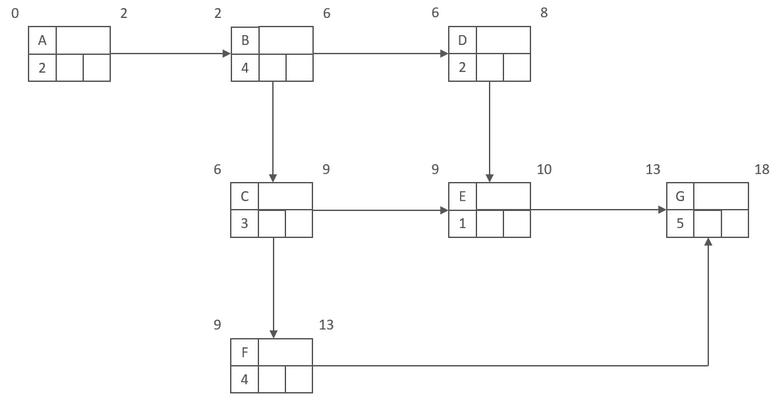
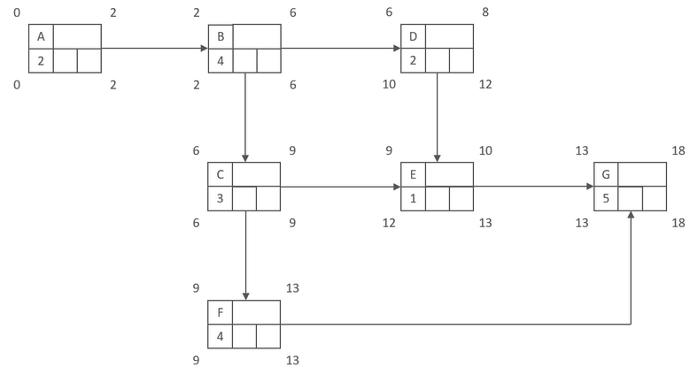
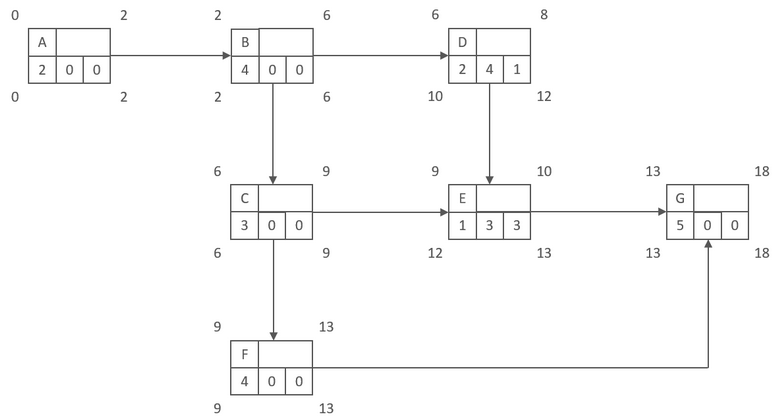

# Erstellung eines Netzplans

## Beispiel Daten

+ Alle folgenden Erläuterungen ergeben sich aus diesem Datensatz.

|Prozessschritt|Dauer in Stunden|Vorher zu beenden|
|-|-|-|
|A|2|-|
|B|4|A|
|C|3|B|
|D|2|B|
|E|1|C,D|
|F|4|C|
|G|5|E,F|

## Erklärung der Abkürzungen

|Bezeichnung|Bedeutung|
|-|-|
PS |Prozessschritt
D  |Dauer des Vorganges
FAZ|Frühester Anfangszeitpunkt
FEZ|Frühester Endzeitpunkt
SAZ|Spätester Anfangszeitpunkt
SEZ|Spätester Endzeitpunkt
GP |Gesamte Pufferzeit
FP |Freie Pufferzeit

## Aufbau eines Knotens

## 1. Knoten Verknüpfen

Zuerst müssen alle Knoten miteinander verknüpft werden.
Oben Links wird der Prozessschritt eingetragen, darunter folgt die
Dauer des Prozesses.

## 2. Vorwärtsterminierung

Im nächsten Schritt, werden die Frühesten Anfangszeitpunkte und die
frühesten Endzeitpunkte eingetragen.
Hierbei werden die Zeiten mit den der Prozessdauer addiert und immer an den nächsten Knoten weiter gegeben.
Sollten zwei Knoten auf einen anderen Knoten verweisen, so wird die höhere Zeit als frühester Startpunkt übernommen.
Dies geschieht hier zum Beispiel im falle von B.
Dieser ist von D und C abhängig, da C mit neun aber einen höheren Endzeitpunkt hat als D mit acht, wird als Anfangszeitpunkt die neun gewählt.

## 3. Rückwärtsterminierung
Die Rückwärtsterminierung läuft ähnlich ab wie die Vorwärtsterminierung.
Bei der Rückwärtsterminierung wird vom Ende zum Anfang gewandert, wobei
der früheste Endzeitpunkt des letzten Knoten als Startwert dient.
Dieser wird mit der Laufzeit des Prozesses subtrahiert und aufgeschrieben.
Dieser subtrahierte Wert wird an die dahinterliegenden Knoten weiter gegeben.
Sollte es hierbei zu zwei Abhängigkeiten kommen, so wird der kleinere Wert übernommen.
Dies ist zum Beispiel bei C der Fall. C ist von E und F abhängig. E hat den Wert 12 und F hat den Wert neun. Da neun kleiner ist als 12, wird die neun als Ausgangswert an C weitergegeben.

## 4. Berechnung der Pufferzeiten

Im letzten Schritt werden die Pufferzeiten Berechnete die Pufferzeiten unterteilen sich hierbei in Gesamte und freie Pufferzeit.
Die Berechnung der Pufferzeiten erfolgt durch die folgenden Formeln.

GP = SEZ-FEZ

FP = FAZ(Nachfolger) - FEZ

Nehmen wir als Beispiel den Knoten D und berechnen seine Pufferzeiten.
Der gesamte Puffer ergibt sich aus dem Spätesten Anfangszeitpunkt subtrahiert vom Frühesten Endzeitpunkt.

SEZ(D) = 12

FEZ(D) = 8

12-8=4

Die gesamte Pufferzeit für D beträgt also den Wert vier.
Bei der Freien Pufferzeit Nehmen wir die Früheste Anfangszeit des Nachfolgers. Sofern wir mehr als einen Nachfolger haben, nehmen wir die niedrigste Frühe Anfangszeit. Von dieser frühesten Anfangszeit subtrahieren wir die Früheste Endzeit.
Im fall von D ergibt sich folgende Rechnung.

FAZ(Nachfolger(E)) = 9

FEZ(D) = 8

9-8=1

Der Freie Puffer beträgt also den Wert 1.

### Unterschied zwischen Gesamter und freier Pufferzeit

Die Gesamte Pufferzeit bezieht sich auf das gesamte Projekt und sagt aus, wie lange sich ein Prozess verzögern kann, ohne das sich das gesamte Projekt verzögert.
Die Freie Pufferzeit bezieht sich hingegen auf den darauf folgenden Prozess und beschreibt, in wie weit sich der vorherige Prozess verzögern darf, ohne den darauffolgenden Prozess zu beeinträchtigen.

## 5. Kritischen Pfad ermitteln

Der kritische Pfad gibt an, welche Prozesse sich unter keinen Umständen verzögern sollen, da dies zu einer Verschiebung des Projektes führen könnte.
Um den Kritischen Pfad zu ermitteln, werden alle Prozesse markiert, die keinen Puffer haben, sprich beim Freien als auch beim gesamten Puffer auf 0 stehen.

## Quellen

+ Netz-Plan: [Modu learn.de](https://www.modu-learn.de/verstehen/management/netzplantechnik/)
+ Pufferzeiten: [Youtube Marius Ebert](https://www.youtube.com/watch?v=-xntsgqyOuU)
+ Übersicht Netzplan: [Youtube Projekte leicht gemacht](https://www.youtube.com/channel/UC3t4HjrbrLD4vM13bc5Kgqg)

