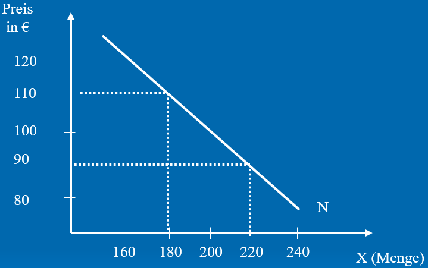

# Markt und Preis

+ Der Preis, die Menge und die Nachfrage haben jeweils Auswirkungen auf den jeweils anderen

## Preis und Menge

+ Die Menge eines Gutes bestimmt in den Meisten fällen den Preis
+ Ist ein Gut in hoher Menge vorhanden, so wird normalerweise der Preis fallen
+ Ist ein Gut nur in geringer Menge vorhanden, so steigt der Preis
+ Die beeinflusst zudem die Nachfrage, da eine Ware die teurer wird weniger nachgefragt wird, wohingegen eine Günstige Ware mehr nachgefragt wird
+ Auf der Grafik sehen wir eine Nachfragefunktion, welche darstellt, wie sich die Nachfrage in Abhängigkeit von Preis und Menge verhält