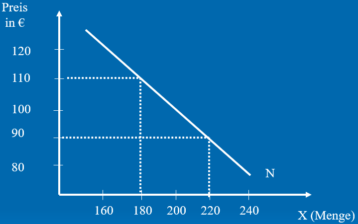

# Markt und Preis

+ Der Preis, die Menge und die Nachfrage haben jeweils Auswirkungen auf den jeweils anderen

## Preis und Menge



+ Die Menge eines Gutes bestimmt in den Meisten fällen den Preis
+ Ist ein Gut in hoher Menge vorhanden, so wird normalerweise der Preis fallen
+ Ist ein Gut nur in geringer Menge vorhanden, so steigt der Preis
+ Die beeinflusst zudem die Nachfrage, da eine Ware die teurer wird weniger nachgefragt wird, wohingegen eine Günstige Ware mehr nachgefragt wird
+ Auf der Grafik sehen wir eine Nachfragefunktion, welche darstellt, wie sich die Nachfrage in Abhängigkeit von Preis und Menge 

## Wichtig

### Berechnung
+ Der Gleichgewichtspreis liegt vor, sobald Nachfrage und Angebot gleich sind
+ Ein Angebotsüberhang ist die angebotene Menge minus der Nachfrage
+ Der Größt mögliche Ermusatz ergibt sich aus dem Preis multipliziert mit dem Angebot, an der Stelle wo der Gleichgewichtspreis liegt

```
Berechnung der Konsumentenrente
Gleichgewichtspreis = 4
BereitschaftZuZahlen = 5
GekaufteMenge = 200

Konsumentenrente = (Gekauftemenge*BereitschaftZuZahlen)-(Gleichgewichtspreis*GekaufteMenge) =>

(200*5)-(200*4) = 200 
```

```
Berechnung des Nachfrage Überhangs
NachgefrageMenge = x Position der Nachfragefunktion am gegebenen Preis
AngeboteneMenge = x Position der Angebotsfunktion am gegebenen Preis

NachfrageÜberhang = NachfrageMenge-AngeboteneMenge
```

```
Setzen eines Mindestpreises

ZielPreis = 6
NachfrageBeiZielpreis = 100
AngebotBeiZielpreis = 700

Abschöpfung = (AngebotBeiZielpreis-NachfrageBeiZielpreis)*ZielPreis =>

(700-100)*6 = 3600
```


### Verschiebungen Angebot

+ Die Verschiebung der Angebotsfunktion erhöht, oder vermindert die Anzahl eines Gutes
+ Bei einer Erhöhung des Angebotes kommt es zur Rechtsverschiebung, bei einer verringerung zur Linksverschiebung
+ Ein Substitutionsgut kann eine anderes Gut ersetzen, da dieses ähnliche Bedürfnisse erfüllt
+ Gründe dafür können Einkommen, Modewandel, Preisveränderungen, Neue Substitutionsgüter, Technischer Fortschritt, oder Werbung sein.

### Verschiebung Nachfrage

+ Durch eine Verschiebung der Nachfragefunktion nach Rechts, können Haushalte zum gelichen Preis eine höhere Menge eines Gutes kaufen
+ Durch eine Verschiebung nach links, können die Haushalte zum gleichen Preis nur eine geringere Menge des Guts erhalten.