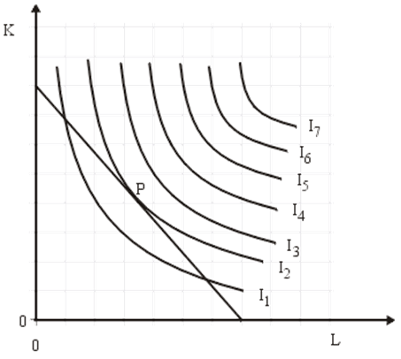

# Minimalkostenkombination

## Definition

+ Als Minimalkostenkombination bezeichnet man eine Kombination von Produktionsfaktoren, mit welcher entweder mit einer festen Menge an Faktoren die Größtmögliche Menge hergestellt werden soll (Maximalprinzip), oder ein festes Ziel mit mit der kleinst möglichen Menge an Produktionsmitteln erreicht werden soll (Minimalprinzip)

+ Das ziel beider Prinzipien ist die Gewinnmaximierung

## Beispiel



### Beschreibung

+ Die Grafik stellt ein Verhältnis zwischen Kapital und Arbeitskraft dar und gibt an, wie viel ME am Ende hergestellt wird.

+ Die X Achse gibt den Wert für die Arbeit an und die Y Achse stellt das Kapital dar

+ Auf dem Feld selbst wird der ME wert dargestellt

+ Die Verbindung von Arbeit und Kapital soll am Ende eine bestimmte Menge an ME schaffen

### Isoquanten

+ Auf der Grafik sind sieben Isoquanten zu sehen, welche mit I und einer Nummer dazu markiert sind
+ Jede Isoquante hat einen Zielwert, in dieser Grafik hat die Isoquante I1 den Zielwert 100 ME
+ Das heißt, dass alle Punkte die sich auf der Isoquante I1 befinden mit einem Unterschiedlichen Einsatz von Kapital und Arbeit 100 ME erzeugen
+ Jede weitere Isoquante ist um den Wert 100 erhöht

```
I1 = 100 ME
I2 = 200 ME
I3 = 300 ME
I4 = 400 ME
I5 = 500 ME
I6 = 600 ME
I7 = 700 ME
```

### Nutzen der Isoquanten

+ Durch die Isoquanten kennen wir alle Kombinationen von Kapital und Arbeit, die einen bestimmten wert an ME erzeugen
+ Jedoch ist nicht jeder Einsatz von Kapital und Arbeit der zum Beispiel 100 ME erzeugt gleich sinnvoll.
+ In der Oberen Grafik wird davon ausgegangen, dass eine Einheit Arbeit 800 GE kostet und eine Einheit Kapital 700 GE
+ Daher ist eine Kombination mit geringerer Arbeitskraft meist billiger, als eine Kombination die mehr Arbeitskraft erfordert

### Kosten von Arbeit und Kapital

+ Das ziel ist in diesem Beispiel mit 5.600,00 GE Einheiten 200 ME herzustellen und das möglichst günstig
+ Hierbei werden die Kombinationen von Arbeit und Kapital erstellt, welche 5.600,00 GE kosten

|Kapital|Arbeit|GE Kapital|GE Arbeit|
|-|-|-|-|
|8|0|5.600|0|
|6|1,75|4.200|1.400|
|4|3,5|2.800|2.800|
|2.89|5|1.600|4.000|
|0|7|0|5.600|

+ Zeichnet man diese Werte in die Graphik ein, so ergibt sich die Gerade P
+ Diese Gerade gibt die Kombinationen an, in denen das Kapital ausgegeben werden kann, um die 5.600 GE zu verbrauchen
+ Diese trifft sich an einer Stelle mit der Isoquante I2, welche uns angibt, dass an dieser Stelle 200 ME hergestellt werden
+ Daher ist dieser Punkt die Minimalkostenkombination