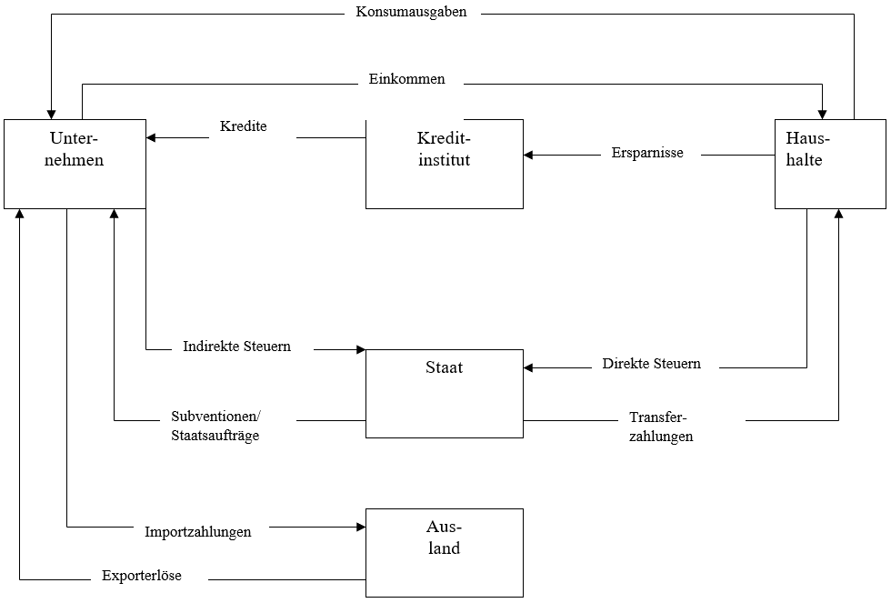

# Vollständiger Wirtschaftskreislauf

## Erweiterung um Kreditinstitute

+ Der Vollständige Wirtschaftskreislauf ist um Kreditinstitute (Banken) erweitert
+ Die Aufgabe der Banken ist es das Kapital zu verwalten
+ Die Notwendigkeit einer Bank ergibt sich aus den Arten des Sparens

|Art|Funktion|
|-|-|
|Horten|Geld wird vom Besitzer ohne ein form von Kredit angesammelt|
|Eigentliches Sparen|Das Geld wird über Kredite an Unternehmen für Zinsen weiter gegeben|

+ Beim Horten wird das Geld dem Wirtschaftskreislauf entzogen sprich es steht in diesem Zeitraum niemanden zur Verfügung und trägt nicht zum Wachstum der Wirtschaft bei
+ Beim eigentlichen Sparen wird diese Geld über Kredite an Unternehmen weitergegeben.
+ Die Unternehmen können dieses Geld investieren und sind aufgrund der Zinsen dazu gezwungen einen Mehrwert zu schaffen
+ Das Geld bleibt beim Sparen also im Wirtschaftskreislauf und regt das Wachstum an

## Erweiterung um einen Staat

### Funktion

+ Der Staat hat die Aufgabe Kollektive Bedürfnisse zu befriedigen
+ Beispiele dafür sind Bildung, Krankenhäuser, Sicherheit, Infrastruktur, etc.
+ Zudem kümmert er sich um individuelle Bedürfnisse
+ Zum Beispiel Renten, Sozialhilfe, Arbeitslosengeld, oder Subventionen

### Finanzierung

+ Der Staat finanziert sich über Steuern

|Steuer Typ|Beispiele|
|-|-|
|Direkte Steuern|Lohnsteuer|
|Indirekt|Umsatzsteuer|
|Gebühren & Abgaben|Müllabfuhr, Abwasserreinigung, Personalausweis|
|Beiträge (Keine Steuer)|Sozialversicherung|

## Übersicht

|Akteure|Funktion|
|-|-|
|Unternehmen|Stellen Güter und Dienstleistungen bereit|
|Kredit Institut|Verwalten das Kapital Gewinnbringend über Kredite|
|Haushalte|Zahlen steuern an den Staat, Erhalten Einkommen von Unternehmen, Konsumieren die Güter der Unternehmen|
|Staat|Nimmt Steuern von Haushalten und Unternehmen und Befriedigt damit Kollektive Bedürfnisse|
|Ausland|Nimmt überschüssige Güter der Unternehmen an und stellt Güter bereit, die nicht von den Unternehmen produziert werden können, oder nicht nicht im ausreichenden maß|

## Vokabeln

|Begriff|Bedeutung|
|-|-|
|Kollektives Bedürfnis|Stellt Bedürfnisse und Wünsche dar, die für eine Große Mehrheit der Bevölkerung gilt|